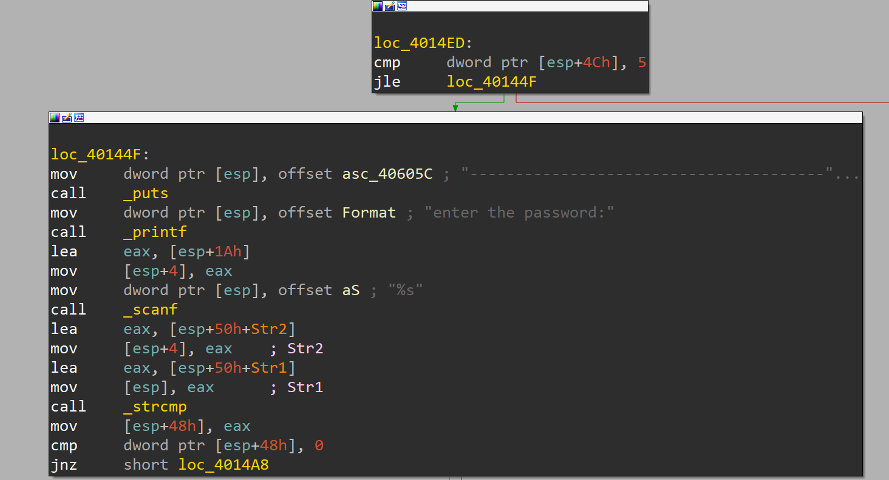
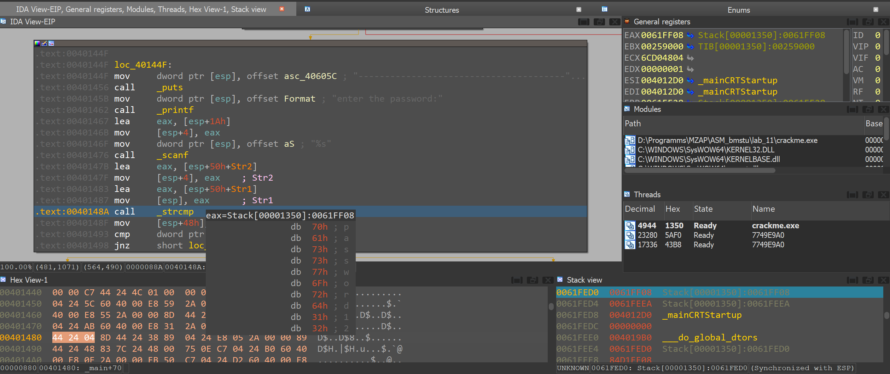
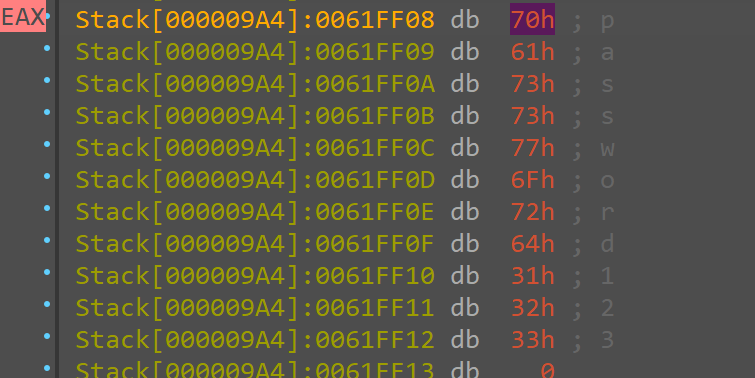
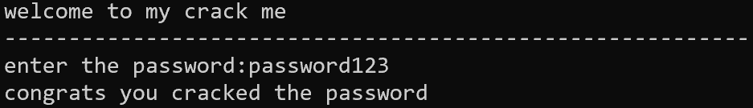

# Лабораторная работа №11 по Машинно-зависимым языкам программирования

## Цель
определить пароль, необходимый для получения сообщения "congrats you cracked the password" в [программе](https://crackmes.one/crackme/5fe8258333c5d4264e590114)

---

## Решение

1. Запускаем IDA

2. Открываем в нем наш исполняемый файл

3. Находим строчку сравнения введенного пароля и правильного

и ставим точку остонова на это сравнение

4. Запускаем исполняемый файл и смотрим что лежит в регистре с правильным паролем (EAX)

5. Получаем пароль “password123”

6. Вводим в программу полученный пароль и получаем положительный результат

